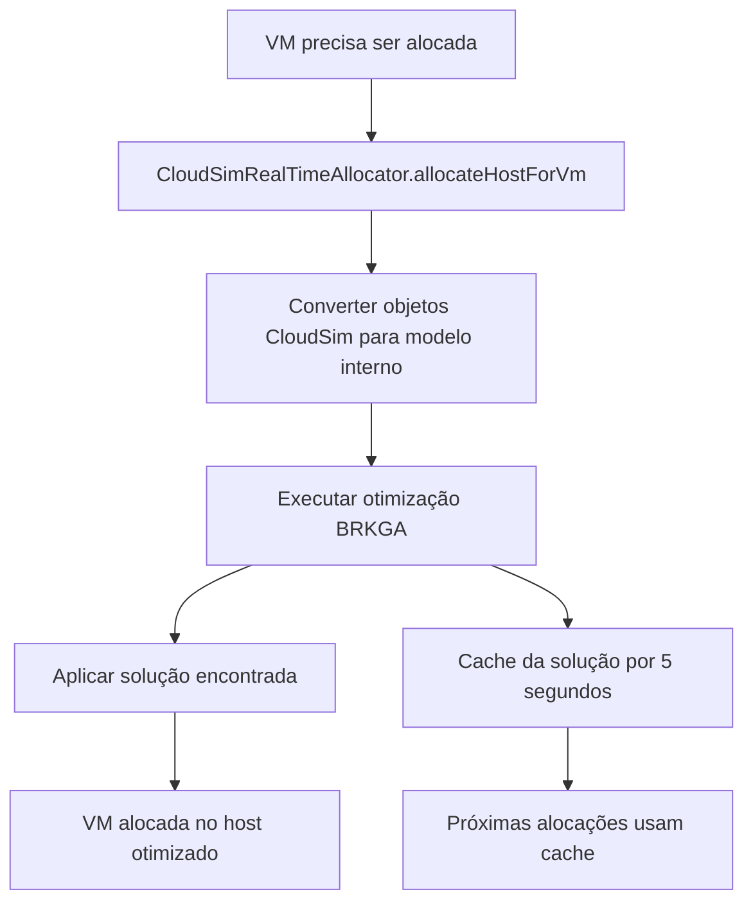

# Alocação de VMs em Tempo Real com CloudSim

## Visão Geral

Este sistema implementa alocação otimizada de máquinas virtuais **diretamente** com objetos CloudSim como entrada, realizando otimização em tempo real durante a simulação. Ao invés de trabalhar com dados estáticos ou arquivos, o sistema recebe Hosts e VMs criados diretamente no CloudSim e aplica algoritmos de otimização para encontrar a melhor alocação.

## 🎯 Diferença Principal

### **Antes**: Sistema baseado em dados estáticos
```java
// 1. Ler dados de arquivo JSON
ProblemInstance instance = reader.readFromFile("instance.json");

// 2. Otimizar
VMAllocationOptimizer optimizer = new VMAllocationOptimizer(instance, params);
OptimizationResult result = optimizer.optimize();

// 3. Converter resultado para CloudSim e simular
CloudSimSimulator simulator = new CloudSimSimulator(instance, simParams);
SimulationResults simResult = simulator.runSimulation(result.getBestSolution());
```

### **Agora**: Sistema integrado com CloudSim em tempo real
```java
// 1. Criar hosts e VMs diretamente no CloudSim
List<Host> hosts = createCloudSimHosts();
List<Vm> vms = createCloudSimVMs();

// 2. Usar alocador otimizado que trabalha em tempo real
CloudSimRealTimeAllocator allocator = CloudSimRealTimeAllocator.createRealTimeOptimized();

// 3. CloudSim automaticamente chama o otimizador quando VMs precisam ser alocadas
Datacenter datacenter = new DatacenterSimple(simulation, hosts);
datacenter.setVmAllocationPolicy(allocator); // ✨ Aqui está a mágica!
```

## 🚀 Como Funciona

O `CloudSimRealTimeAllocator` atua como uma **política de alocação do CloudSim** que:

1. **Intercepta** pedidos de alocação de VMs
2. **Converte** objetos CloudSim para nosso modelo interno automaticamente
3. **Executa** otimização usando BRKGA para encontrar alocação ótima
4. **Aplica** o resultado diretamente na simulação CloudSim
5. **Cache** resultados para performance (TTL configurável)

### Fluxo de Execução



## 📋 Exemplos de Uso

### 1. Exemplo Básico

```java
import com.ramonyago.cloudsim.simulation.CloudSimRealTimeAllocator;

public class BasicExample {
    public static void main(String[] args) {
        // Criar simulação
        CloudSimPlus simulation = new CloudSimPlus();
        
        // Criar alocador otimizado
        CloudSimRealTimeAllocator allocator = CloudSimRealTimeAllocator.createRealTimeOptimized();
        
        // Criar hosts e VMs CloudSim normalmente
        List<Host> hosts = createHosts();
        List<Vm> vms = createVMs();
        
        // Datacenter com alocação otimizada
        Datacenter datacenter = new DatacenterSimple(simulation, hosts);
        datacenter.setVmAllocationPolicy(allocator);
        
        // Resto da simulação normal
        DatacenterBroker broker = new DatacenterBrokerSimple(simulation);
        broker.submitVmList(vms);
        
        simulation.start();
        
        // Ver estatísticas da alocação
        System.out.println(allocator.getCurrentAllocationStatistics());
    }
}
```

### 2. Exemplo com Alocação Dinâmica

```java
public class DynamicExample {
    public static void main(String[] args) {
        CloudSimPlus simulation = new CloudSimPlus();
        CloudSimRealTimeAllocator allocator = CloudSimRealTimeAllocator.createBalanced();
        
        // Setup inicial...
        
        // Programar chegada de novas VMs durante simulação
        simulation.addOnClockTickListener(info -> {
            if (info.getTime() == 10) {
                // Nova VM chegando
                Vm newVm = new VmSimple(2000, 1);
                newVm.setRam(4096).setSize(50000);
                
                broker.submitVm(newVm);
                
                // Forçar reotimização com nova configuração
                allocator.forceReoptimization();
            }
        });
        
        simulation.start();
    }
}
```

### 3. Comparação de Performance

```java
public class PerformanceComparison {
    public static void main(String[] args) {
        // Teste com alocador simples padrão
        long simpleTime = measureTime(() -> runWithSimpleAllocator());
        
        // Teste com nosso alocador otimizado
        long optimizedTime = measureTime(() -> runWithOptimizedAllocator());
        
        System.out.printf("Simple: %d ms, Optimized: %d ms\n", simpleTime, optimizedTime);
        System.out.printf("Overhead: %.1f%%\n", (double)optimizedTime/simpleTime * 100 - 100);
    }
}
```

## ⚙️ Configurações do Alocador

### Perfis Pré-definidos

```java
// Para tempo real (rápido, menos preciso)
CloudSimRealTimeAllocator allocator = CloudSimRealTimeAllocator.createRealTimeOptimized();
// Configurações: 20 indivíduos, 30 gerações, cache 5s

// Para qualidade balanceada
CloudSimRealTimeAllocator allocator = CloudSimRealTimeAllocator.createBalanced();
// Configurações: 40 indivíduos, 50 gerações, cache 5s

// Customizado
OptimizationParameters params = new OptimizationParameters.Builder()
    .brkgaPopulationSize(60)
    .brkgaMaxGenerations(100)
    .archiveSize(30)
    .decodingStrategy(DecodingStrategy.GREEDY_RANDOMIZED)
    .build();
CloudSimRealTimeAllocator allocator = new CloudSimRealTimeAllocator(params);
```

### Métodos de Controle

```java
// Forçar nova otimização (ignora cache)
allocator.forceReoptimization();

// Obter estatísticas atuais
AllocationStatistics stats = allocator.getCurrentAllocationStatistics();
System.out.println("VMs alocadas: " + stats.allocatedVms);
System.out.println("Hosts ativos: " + stats.activeHosts);
System.out.println("Custo total: " + stats.totalCost);
System.out.println("Energia: " + stats.totalEnergyConsumption);
```

## 🔧 Conversão Automática

O sistema converte automaticamente:

### CloudSim Host → Modelo Interno
- **MIPS capacity** → CPU capacity (MIPS/1000)
- **RAM** → RAM capacity (MB → GB)  
- **Storage** → Storage capacity (MB → GB)
- **Bandwidth** → Network capacity (Mbps → Gbps)
- **Custo** → Calculado baseado em capacidade
- **Confiabilidade** → Calculada baseada em utilização

### CloudSim VM → Modelo Interno
- **MIPS demand** → CPU demand (MIPS/1000)
- **RAM** → RAM demand (MB → GB)
- **Storage** → Storage demand (MB → GB)
- **Bandwidth** → Network demand (Mbps → Gbps)
- **Confiabilidade mínima** → Calculada baseada em recursos
- **Prioridade** → Calculada baseada em demanda total

## 📊 Objetivos de Otimização

O algoritmo otimiza simultaneamente:

1. **Custo**: Minimizar custo total de ativação dos hosts
2. **Confiabilidade**: Garantir requisitos mínimos de confiabilidade
3. **Utilização**: Maximizar eficiência de uso dos recursos
4. **Energia**: Considerar consumo energético dos hosts

## 🔄 Cache e Performance

- **Cache TTL**: 5 segundos (configurável)
- **Invalidação**: Automática quando VMs são desalocadas
- **Força reotimização**: Método `forceReoptimization()`
- **Fallback**: Alocação first-fit se otimização falhar

## 📈 Vantagens

✅ **Integração Direta**: Sem necessidade de arquivos externos  
✅ **Tempo Real**: Otimização durante a simulação  
✅ **Dinâmico**: Suporta chegada/saída de VMs durante execução  
✅ **Automático**: Conversão transparente entre modelos  
✅ **Flexível**: Múltiplos perfis de configuração  
✅ **Robusto**: Fallback para alocação simples se necessário  
✅ **Performance**: Sistema de cache para reduzir overhead  

## 🚦 Executando os Exemplos

```bash
# Compilar o projeto
mvn compile

# Executar aplicação principal (inclui demo de alocação em tempo real)
mvn exec:java -Dexec.mainClass="com.ramonyago.cloudsim.App"

# Executar exemplo específico de alocação em tempo real
mvn exec:java -Dexec.mainClass="com.ramonyago.cloudsim.examples.RealTimeAllocationExample"
```

## 📝 Log de Saída Esperado

```
=== REAL-TIME ALLOCATION DEMO - CloudSim Objects as Input ===
Starting real-time allocation simulation:
  Hosts: 4 (created directly in CloudSim)
  VMs: 6 (created directly in CloudSim)
  Cloudlets: 18
  Allocation Policy: CloudSimRealTimeAllocator

REAL-TIME ALLOCATION RESULTS:
Allocation Statistics: AllocationStats{VMs: 6/6 (100.0%), ActiveHosts: 3, Cost: 270.00, Energy: 420.00 kWh}
Cloudlets completed: 18
Average cloudlet execution time: 8.45 seconds
Total cloudlet cost: $156.30
Simulation execution time: 1247 ms

VM ALLOCATION DETAILS:
Host 1: 3 VMs allocated
  VM 1 (CPU: 4000 MIPS, RAM: 4096 MB, Storage: 50000 MB)
  VM 5 (CPU: 5000 MIPS, RAM: 8192 MB, Storage: 40000 MB)
  Host utilization - CPU: 50.0%, RAM: 75.0%

Host 2: 2 VMs allocated
  VM 2 (CPU: 2000 MIPS, RAM: 2048 MB, Storage: 25000 MB)
  VM 4 (CPU: 3000 MIPS, RAM: 6144 MB, Storage: 80000 MB)
  Host utilization - CPU: 62.5%, RAM: 100.0%

Host 4: 1 VMs allocated
  VM 3 (CPU: 1000 MIPS, RAM: 1024 MB, Storage: 15000 MB)
  VM 6 (CPU: 1500 MIPS, RAM: 3072 MB, Storage: 35000 MB)
  Host utilization - CPU: 20.0%, RAM: 33.3%

REAL-TIME ALLOCATION ADVANTAGES:
✓ Direct integration with CloudSim objects
✓ No need for external data files or conversion  
✓ Real-time optimization during simulation
✓ Dynamic reallocation support
✓ Cost and reliability optimization
✓ Energy efficiency considerations
```

Agora você tem um sistema completo que recebe **diretamente** objetos Host e VM do CloudSim como entrada e faz alocação otimizada em tempo real! 🎉 